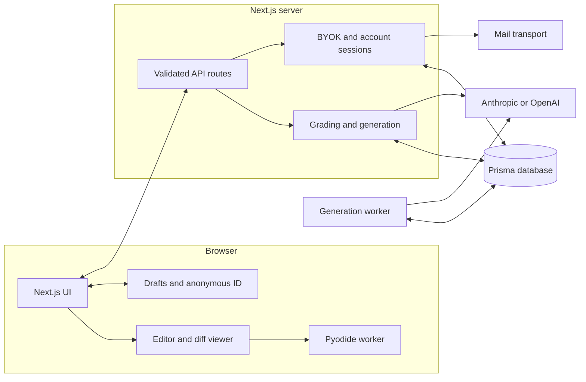
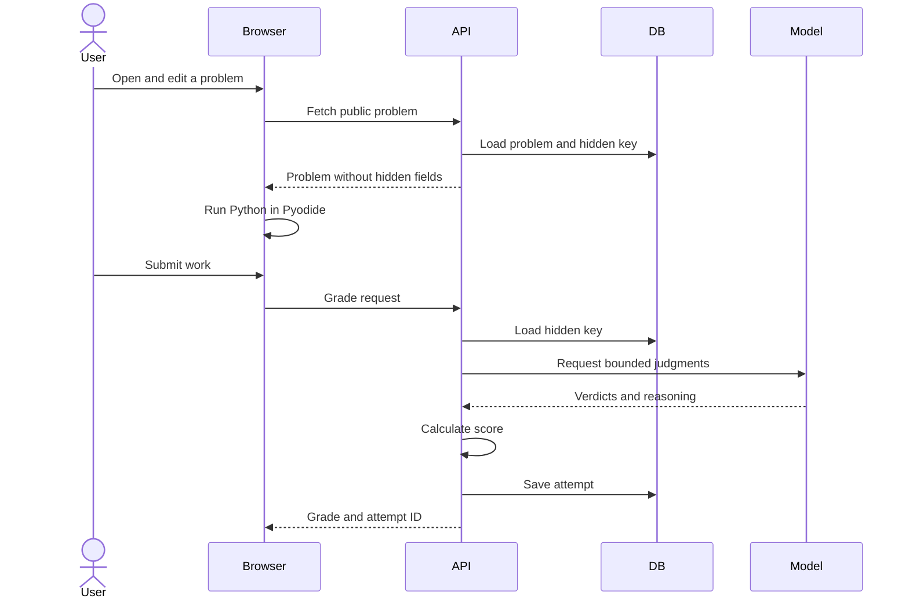

# Anvil architecture

Anvil is a Next.js application for debugging, code-review, and system-design
practice. The browser runs candidate Python; the server owns hidden answer keys,
persists attempts, and proxies model calls made with the user's provider key.

## Core rules

1. Candidate code runs only in a Pyodide Web Worker.
2. Hidden answer keys never cross the public API boundary.
3. Application code calculates scores; models return bounded judgments.
4. User provider keys are sealed in expiring HttpOnly cookies and never stored.
5. Raw job descriptions and contributed questions are not persisted.
6. Anonymous use works without an account; sign-in only adds durable ownership.

## System map

## Solve flow

## Main components

| Area | Responsibility |
|---|---|
| `app/` | Pages and API routes |
| `components/solve/` | Debug, review, design, and interview workspaces |
| `lib/pyodide/` | Browser execution and test harness |
| `lib/grading/` | Deterministic matching and score calculation |
| `lib/ai/`, `lib/anthropic/` | Provider clients, prompts, retries, and streaming |
| `lib/auth/` | Email-link accounts and anonymous-work adoption |
| `lib/generation/` | Problem generation and verification |
| `lib/worker/` | Database-backed generation queue |
| `prisma/` | Schema, migrations, and authored problem bank |

## Data model

| Model | Purpose |
|---|---|
| `Problem` | Public prompt plus server-only key, tests, rubric, provenance, and curation data |
| `Attempt` | Submission, grade, transcript, model provenance, and owner |
| `Vote` | One problem rating per anonymous or account owner |
| `User` | Optional email identity |
| `LoginToken` | Hashed, expiring, single-use sign-in token |
| `GenerationJob` | Worker queue state and progress |
| `Contribution` | Sanitized contribution receipt; never raw source text |

## API groups

| Routes | Purpose |
|---|---|
| `/api/problems/*` | Browse, fetch, randomize, and vote without exposing keys |
| `/api/grade`, `/api/hint`, `/api/socratic` | Interactive learning loop |
| `/api/jd/match`, `/api/generate/*` | Retrieval and verified problem generation |
| `/api/contributions` | Sanitize, deduplicate, and process contributed ideas |
| `/api/byok` | Validate, seal, inspect, and clear provider sessions |
| `/api/auth/*`, `/api/history` | Optional accounts and owned attempts |

All model-bound payloads are validated and size-limited with Zod. Streaming
routes use SSE and propagate cancellation to provider calls.

## Security boundaries

- `lib/problem.ts` is the public problem mapper and strips hidden fields.
- BYOK and account cookies use separate derived encryption purposes.
- Same-origin checks protect state-changing cookie-authenticated routes.
- Login tokens are stored as hashes and redeemed once.
- Production sign-in requires a configured mail transport.
- Operator generation requires a separate bearer token and credential.
- Rate limiting is per process locally and must use a shared store when scaled.

## Verification

- `npm run check`: lint, route types, TypeScript, and deterministic tests.
- `npm run build`: production compilation.
- `npm run e2e:smoke`: provider-independent browser coverage.
- `npm run e2e`: optional live-provider browser coverage.

See `SCALING.md` for production constraints.
