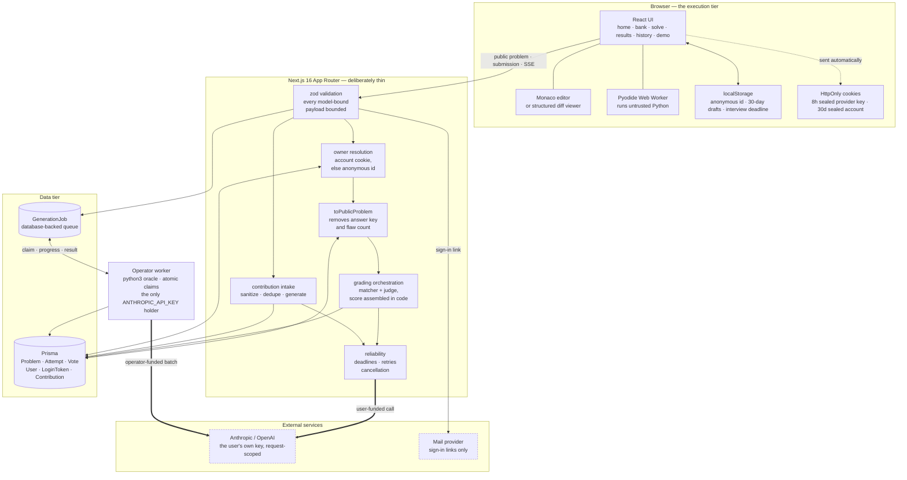
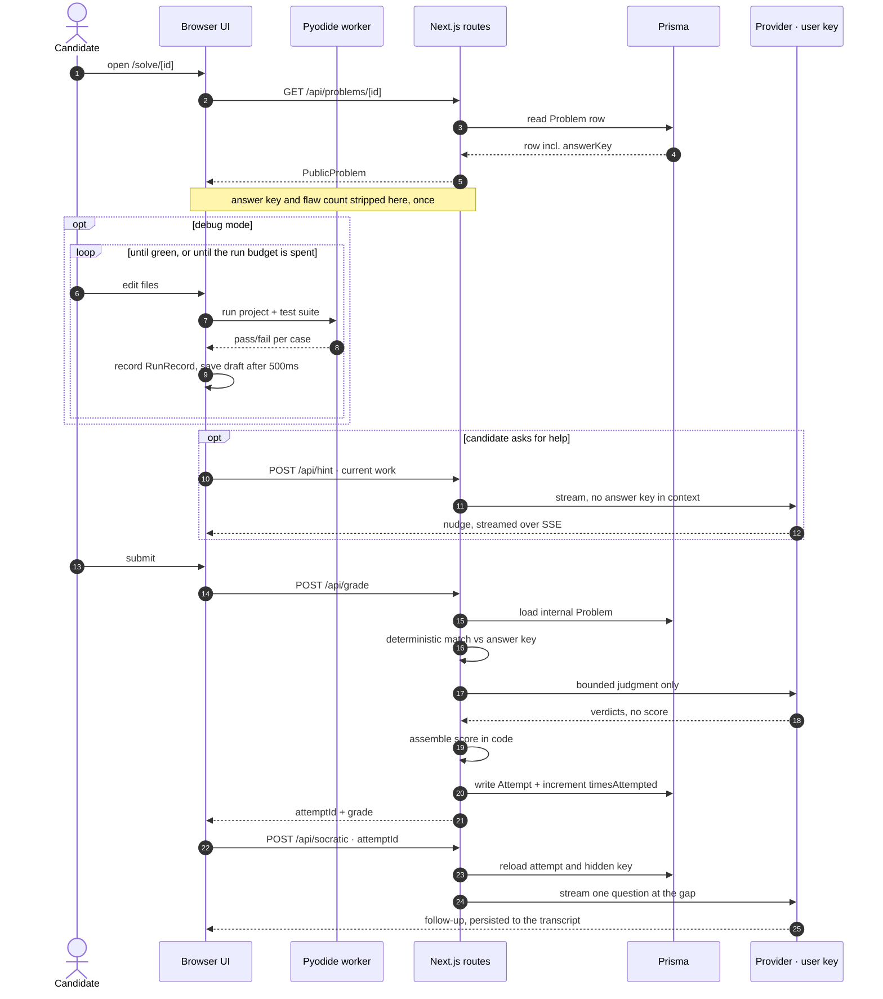
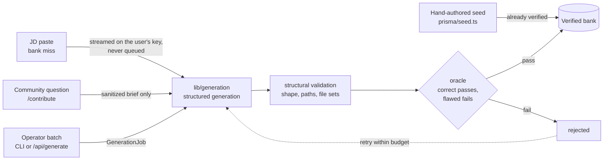
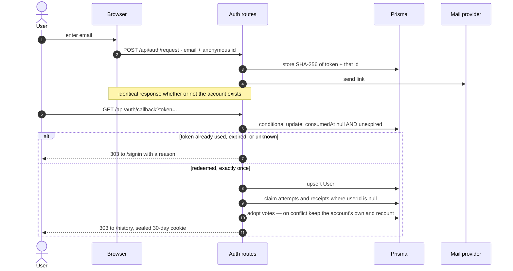
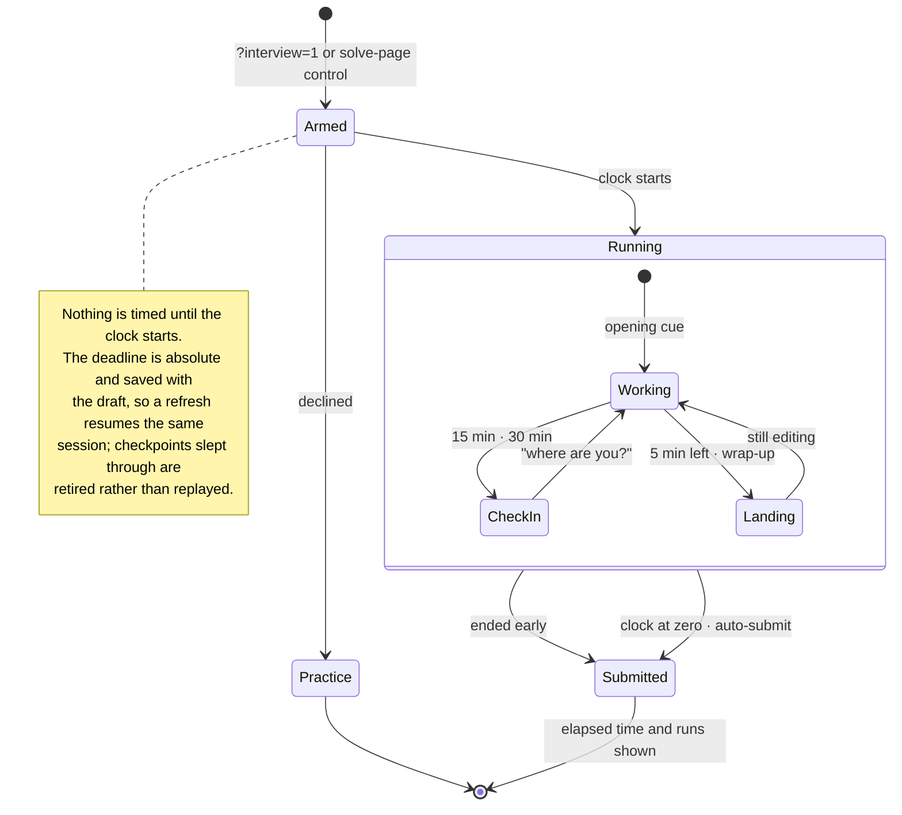

# Anvil architecture

**Status:** implemented system as of 2026-08-01. This document describes the code that exists now. `docs/spec.md` explains the product thesis; `SCALING.md` covers capacity limits and deployment upgrades.

## 1. Core properties

1. **The generator owns the answer key.** Debug and review problems start with correct code, receive planted flaws, and carry a structured hidden key. Design problems use a generated rubric instead of line-anchored flaws.
2. **The browser is the execution tier.** Debug code runs in Pyodide inside a Web Worker. The server never executes a candidate submission.
3. **The answer key stays server-side.** `lib/problem.ts` is the only Prisma-row-to-public-problem mapper. It removes the key, its count, and legacy JD context.
4. **Scoring is assembled in code.** Models supply bounded judgments; `lib/grading/index.ts` owns the numeric formula and persists the model provenance.
5. **A bank miss creates an asset.** JD matching reuses a verified problem when possible; otherwise a streamed BYOK request generates, verifies, and banks a tailored problem. Operator batch generation remains queued on a worker.
6. **Community source is transient.** Interview questions, JD context, and follow-ups are reduced to an abstract skill brief during the live BYOK request. Only derived receipt metadata and a separately authored, verified exercise may be persisted.
7. **Identity is additive.** Every row is owned by an anonymous browser id; an account is a nullable second owner adopted at sign-in. Nothing requires an account, and nothing breaks without one.

## 2. System map

### 2.1 Components

The shape to notice: the browser does the expensive work, the web tier is a
validating pass-through that owns the answer key, and every model call is
funded by the user whose request triggered it. The operator credential appears
in exactly one place, and it is not on a request path.



### 2.2 The core loop, end to end

One attempt from open to follow-up. Two properties are visible in the
ordering: nothing the browser sends can reveal ground truth, and no candidate
code is ever executed server-side.



### 2.3 Where a problem comes from

Four entry paths, one verification gate. Nothing reaches the bank without an
oracle proving the planted flaw actually breaks something.



### 2.4 Identity and the sign-in merge

The merge is the reason accounts exist. Note that the anonymous id is captured
when the link is *requested*, not when it is clicked — that is what lets the
callback know whose work to adopt.



### 2.5 A session under interview conditions

Opt-in only. Practice mode has no clock and no run budget, and this state
machine does not exist for it.



## 3. User journey

### Arriving without a key

Every model-backed path spends the visitor's own provider credential, so a
first-time evaluator would otherwise have to obtain an API key before seeing a
single graded result. `/demo` closes that gap without weakening the
no-platform-key rule: it renders a recorded attempt against a live bank problem.

What is recorded is only the qualitative layer — the reviewer's comments, the
judge's headline and its verdict on the one comment that is not a seeded flaw,
and the follow-up conversation. The problem, the diff, and the answer key are
read from the database at request time, and the score is produced on that
request by `matchReviewComments` and `assembleReviewGrade`, the same functions
the live grader calls. A scoring change moves the demo; the smoke suite asserts
the exact number so it cannot drift into misrepresentation.

### Signing in

Accounts exist for one reason: an anonymous `sessionId` in `localStorage` dies
with the browser. Sign-in is a single-use emailed link — no password, no profile
— and `lib/auth/merge.ts` adopts that browser's unowned attempts, votes, and
contribution receipts into the account.

`POST /api/auth/request` mints a token, stores only its SHA-256 with the
requesting browser's id, and mails the link. It answers identically for known
and unknown addresses so the endpoint is not a membership oracle.
`GET /api/auth/callback` redeems it with a conditional update — parallel clicks
yield exactly one session — creates the account on first use, runs the merge, and
sets a sealed 30-day `SameSite=Lax` cookie.

**The token leaves the process only through a mail transport.** It is never in
a response body, under any configuration. An earlier build returned it when no
provider was configured, gated on `NODE_ENV`, which reduced "prove you own this
address" to nothing: request a link for any address, read it out of your own
response, sign in as them. An environment variable is not a defence — a
container that forgets to set it, or a preview deployment, turns the endpoint
into account takeover. Possession of the inbox is the entire proof, so the
credential is structurally incapable of travelling any other way, and a test
asserts the response body contains no token.

Three transports resolve in order: `RESEND_API_KEY`, then `SMTP_URL`, then
stdout. The last is a development affordance — reading the server's own
terminal is its own proof of access — and `canSendMail()` refuses it in
production, so an unconfigured deployment fails loudly instead of writing live
credentials to a log.

Votes are the one merge conflict: an account may already have voted on a problem
this browser also rated. The account's vote wins, the anonymous row is deleted,
and every affected problem is recounted in the same transaction, which is also
what the `(problemId, userId)` unique index requires.

Reads by an anonymous caller filter on `userId: null`. Signing out therefore
hides the account's work rather than leaving it visible to whoever uses the
browser next, even though the `localStorage` id is unchanged.

### Interview conditions

`?interview=1`, or the solve page's own control, arms timed mode; the clock
starts only after an explicit confirmation, never on load. It then changes three
things: a 45-minute deadline that auto-submits at zero, a three-run budget in
place of iterating to green, and an interviewer who speaks unprompted at two
checkpoints and again at five minutes remaining.

The deadline is absolute and saved with the draft, so a refresh resumes the same
session instead of granting a fresh 45 minutes; checkpoints passed while the tab
was closed are retired rather than delivered late. Cues route through
`POST /api/hint` with a server-owned instruction (`lib/interview.ts`), so the
page cannot dictate what the interviewer says. Without a connected key the cues
fall back to scripted lines — the clock and the budget are the substance of
interview mode and neither needs a model.

### Selecting a problem

The home page sends a pasted JD to `POST /api/jd/match`. The selected provider's efficient model extracts tags from the fixed vocabulary in `lib/tags.ts`. Existing problems are ranked by tag overlap, difficulty fit, and Wilson score. Explicit domains such as robotics, video, payments, or search act as relevance gates: generic systems overlap cannot satisfy a domain-specific role. If no candidate clears the threshold, `POST /api/generate/tailored` streams generation and verification phases using the connected key, persists the verified result, and opens it automatically. A later similar JD can reuse that bank asset.

Interactive model work requires a user-owned Anthropic or OpenAI API key. `POST /api/byok` verifies the key against the selected provider's Models API, seals the provider and key with AES-256-GCM, and returns an eight-hour HttpOnly/SameSite cookie (`Secure` on HTTPS). AI routes decrypt it only for the current request and create an uncached provider client. There is no fallback to the operator key. The plaintext is never written to Prisma, localStorage, logs, or response bodies. OpenAI Responses API calls set `store: false`.

The tailored route holds the decrypted key only in the live request. It persists the finished problem and its fixed-vocabulary tags, but never the key or source JD. Disconnecting aborts provider work rather than moving the credential into a queue. This path requires a long-lived Node runtime with `python3`; the operator `POST /api/generate` queue remains the scalable batch path and still requires a bearer token.

### Contributing a real interview question

`/contribute` sends the question, optional role context, and follow-ups to `POST /api/contributions`. A first provider call extracts an abstract, de-identified skill brief and bounded quality/privacy signals. Code-owned thresholds reject credentials, confidential material, behavioral trivia, and low-signal input. A second call compares the brief with a tag-shortlisted set of verified problems. A high-confidence match links to the existing problem; otherwise the shared generator authors a new scenario from only the sanitized brief and runs its normal oracle before persistence.

The route never passes source fields to Prisma, logging, or a background queue. Accepted and duplicate outcomes also clear the form fields. Rejected, duplicate, and accepted receipts contain derived metadata for operating the quality gate, not the submitted wording or a reversible hash.

### Solving

- **Debug:** editable multi-file Monaco project, read-only neighbor files, Pyodide tests, run history.
- **Review:** structured multi-file diff with file-and-line anchored comments.
- **Design:** Monaco-backed design document plus rubric-based grading.
- **Interviewer:** solve-time hints receive only the public problem and current work. They never receive the answer key.

`lib/solveDraft.ts` saves active work after 500 ms and on `pagehide`. Drafts are versioned, validated when read, expire after 30 days, and are scoped by problem id. Debug files/run context, review comments, design text, and chat are restored. A successful grade clears the draft; cancellation and failure retain it.

### Grading and follow-up

`POST /api/grade` validates the submission, loads the internal problem, and dispatches by mode:

- **Review:** deterministic file/line/anchor matching establishes recall. The provider's balanced judge handles unmatched comments and may rescue a conceptually correct off-line comment.
- **Debug:** the last run supplies the objective test result. The balanced judge assesses root-cause quality; the code combines 55% objective result and 45% approach quality.
- **Design:** two strongest-tier judgments are averaged. Divergence above the threshold flags the rubric for curation.

The route stores `Attempt`, atomically increments `Problem.timesAttempted`, and returns `{attemptId, grade}`. `/api/socratic` reloads the persisted attempt and hidden key, streams one question, and persists the transcript.

## 4. Generation and verification

`lib/generation/index.ts` is shared by the BYOK request, CLI, and worker:

```text
prompt/JD/sanitized contribution brief
  -> structured generation
  -> structural validation
  -> execution or rubric oracle
  -> persist verified Problem
```

- Debug verifies that the correct project passes and the buggy project fails.
- Review verifies the pre/post projects and planted change with the same Python execution machinery.
- Design generates strong and weak reference answers and requires the rubric to separate them.
- Opus safety refusals switch generation to the Sonnet fallback without consuming an oracle attempt.
- Transient failures retry within both SDK and job budgets. Queue retries use backoff.

The live BYOK path streams progress directly and never creates a `GenerationJob`, so its credential and JD disappear with the request. The operator worker atomically claims jobs, reclaims stale claims, writes progress notes, and clears the pasted JD on terminal success or failure. SQLite uses a transactional claim path for local development; PostgreSQL uses row-lock semantics when deployed.

## 5. Data model

### `Problem`

Shared metadata plus mode-specific JSON (`files`, `diff`, `testSuite`, `rubric`), hidden `answerKey`, fixed-vocabulary tags, generator provenance, curation tallies, and retirement state.

Authored problems keep their tags beside their definitions in `prisma/seed.ts`. The seed command updates them by authored title and inserts missing entries without deleting attempts.

### `User` and `LoginToken`

An account is an email and nothing else — there is no password column because
there are no passwords. `LoginToken` stores a token hash (never the token), the
requesting browser's id so consumption can merge its work, an expiry, and a
`consumedAt` that makes redemption single-use and replay detectable.

### `Attempt`

Anonymous `sessionId`, optional `userId`, raw submission, debug run history, assembled grade with grader provenance, and Socratic transcript. Keeping the raw submission enables later re-grading. Deleting an account cascades to attempts, which hold the user's own submitted work.

### `Vote`

One row per `(problemId, sessionId)` and, once signed in, one per `(problemId, userId)` — both engines treat NULLs as distinct in a unique index, so the second constrains accounts only. Vote changes and denormalized problem tallies update transactionally; `lib/voting.ts` recounts from source rather than incrementing, so no path can drift them. Deleting an account detaches its votes instead of removing them: a vote is a signal about the problem, not personal content. Retirement is reversible and never deletes history.

### `GenerationJob`

Database-backed queue containing status, retry timing, worker claim time, progress, result, and temporary JD. The JD is cleared on every terminal state.

### `Contribution`

Metadata-only intake receipt containing status, derived type/difficulty/seniority/tags, quality score, rejection reason, provider/model provenance, and optional links to the accepted or duplicate problem. The schema intentionally has no source question, JD, follow-up, sanitized brief, or source-hash column.

The checked-in Prisma datasource is SQLite (`file:./dev.db`). `npm run db:postgres` rewrites the datasource for the PostgreSQL production path. String enums and JSON fields keep domain shapes portable, but migrations remain dialect-specific and must be regenerated/tested for PostgreSQL.

## 6. API surface

| Route | Purpose |
|---|---|
| `GET/POST/DELETE /api/byok` | Inspect, connect, or clear the encrypted key session |
| `POST /api/auth/request` | Mail a single-use sign-in link |
| `GET /api/auth/callback` | Redeem a link, merge anonymous work, set the session |
| `GET/DELETE /api/auth/session` | Inspect or clear the account session |
| `GET /api/problems` | Filtered/ranked public summaries |
| `GET /api/problems/[id]` | Public solve payload |
| `GET /api/problems/random` | Random non-retired problem |
| `POST /api/problems/[id]/vote` | Idempotent curation vote |
| `POST /api/grade` | Validate, grade, persist attempt |
| `POST /api/hint` | Stream solve-time hint without ground truth |
| `POST /api/socratic` | Stream and persist post-grade follow-up |
| `POST /api/jd/match` | Extract tags and match the bank |
| `POST /api/generate/tailored` | Stream BYOK generation after a bank miss |
| `POST /api/contributions` | Sanitize, quality-check, deduplicate, and optionally generate a community problem |
| `POST /api/generate` | Operator-authenticated generation enqueue |
| `GET /api/generate/[id]/stream` | Stream job phase changes |
| `GET /api/history` | Attempts for an anonymous browser session |

All model-bound payloads have explicit zod size limits. Rate limiting is a fixed-window in-memory store locally; the `Store` interface in `lib/ratelimit.ts` is the deployment boundary for Redis/KV.

## 7. Model reliability

`lib/ai/client.ts` owns the provider adapter and OpenAI model routing; `lib/anthropic/models.ts` owns Anthropic routing and operator-generation configuration. `lib/anthropic/reliability.ts` independently owns shared operational policy:

| Call | Deadline | SDK retries |
|---|---:|---:|
| Hint | 45 s | 1 |
| Socratic | 60 s | 1 |
| JD match | 30 s | 2 |
| Contribution intake | 90 s | 2 |
| Contribution duplicate check | 60 s | 1 |
| Debug/review judge | 90 s | 2 |
| Design judge | 120 s | 2 |
| Generation | 8 min | 2 |

The SDK retries only transient classes: network failures, 408, 409, 429, and 5xx. Public errors never expose provider details. They distinguish cancellation, timeout, capacity, configuration, and temporary unavailability, and tell the user when a retry is appropriate.

Browser abort signals flow through `fetch`, Next request signals, grading, and Anthropic request options. A new interviewer turn aborts the superseded stream. Leaving the page aborts active chat/grading. The grading overlay exposes a real cancel action.

## 8. Security and privacy invariants

| Invariant | Enforcement |
|---|---|
| Answer key never reaches solve clients | `toPublicProblem` + serialized-payload tests + live E2E |
| Flaw count is hidden until results | Public type omits key/count |
| Hint cannot see the answer key | Hint route uses `toPublicProblem` |
| Socratic uses persisted ground truth | Client sends only `attemptId` and transcript |
| Score arithmetic is not model-authored | `lib/grading/index.ts` |
| Pasted JD is not banked or served | BYOK generation keeps it request-local; queued operator jobs clear it terminally |
| Community source text is not retained | Request-local intake; metadata-only schema; DB column test; browser-storage smoke test |
| User API keys stay server-side | AES-GCM HttpOnly cookie; request-scoped client; no platform-key fallback |
| BYOK mutations resist CSRF | Exact same-origin validation + SameSite=Strict cookie |
| Untrusted Python stays off the server | Pyodide worker in the browser |
| A key cookie cannot read an account cookie | Per-purpose key derivation in `lib/crypto/sealed.ts` + codec test |
| Sign-in links are unforgeable and single-use | 32 random bytes, hash-only storage, conditional-update redemption |
| Sign-in is not a membership oracle | Identical response for known and unknown addresses + route test |
| Signing out hides account work | Anonymous reads filter `userId: null` (`lib/auth/identity.ts`) |
| A merge cannot take another owner's rows | Every claim requires `userId: null` |
| A sign-in link never reaches an HTTP response | Token exits only via a transport; asserted by test |
| Production never logs a live sign-in link | Stdout transport refused outside development |
| The page cannot script the interviewer | Cue text is server-owned; the client sends only a closed enum |

Solve drafts contain user-authored work and conversation text in that browser's `localStorage`; they expire after 30 days and clear after a successful grade. They are not synchronized to the server.

## 9. Verification

- `npm test`: deterministic unit/integration tests, including isolated DB tests for the queue, login tokens, and the anonymous-work merge, the review scoring formula, the interview clock, and the sign-in routes driven in process.
- `npm run e2e:smoke`: provider-independent Chromium flow. It exercises the BYOK UI, all contribution outcomes, model endpoints, real pages/APIs, Monaco, localStorage, the keyless demo (asserting its exact computed score), interview mode's consent gate and clock, the sign-in UI, and responsive layout. Runs on every push/PR in `.github/workflows/ci.yml`.
- `npm run e2e`: live Chromium loop through BYOK connection, Pyodide, Anthropic grading, Socratic follow-up, curation, navigation, and history. Runs weekly/manual via `.github/workflows/live-e2e.yml`.
- `npm run build`: production Next.js and TypeScript verification.

## 10. Remaining deployment work

1. Exercise the PostgreSQL migration locally and in a staging environment; the checked-in datasource is still SQLite.
2. Install a Redis/KV `Store` before running more than one web instance.
3. Add cursor pagination and a stored/indexed rank score before the bank reaches thousands of rows.
4. Add structured logs/metrics for queue depth, generation rejection, provider latency/cost, and rubric divergence.
5. Move request-scoped generation into an ephemeral-key job system before relying on short-lived serverless functions.
