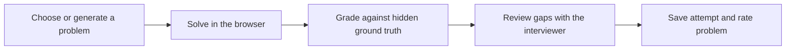

# Anvil product spec

## Goal

Anvil provides repeatable practice for debugging, code review, and system
design. Exercises carry hidden ground truth or rubrics so feedback is specific
and scores are explainable.

## Product modes

### Debug

The candidate edits a small multi-file Python project and runs its tests in the
browser. Grading combines test results with comparison against the hidden issue
key.

### Code review

The candidate reviews a structured diff and leaves line comments. Grading
matches those comments to seeded issues, penalizes false positives, and checks
the quality of the reasoning.

### System design

The candidate writes a design response. Grading evaluates named rubric
dimensions instead of returning an unsupported single score.

### Interview mode

Any exercise can add a 45-minute deadline, a limited test-run budget, and timed
interviewer prompts. Practice mode remains untimed.

## User flow

## Product rules

- The recorded demo works without a provider key.
- Interactive AI features use an Anthropic or OpenAI key supplied by the user.
- Accounts are optional; anonymous attempts remain supported.
- Signing in adopts eligible anonymous attempts and ratings.
- Job descriptions first search the existing bank and generate only on a miss.
- Raw job descriptions and contributed interview questions are not stored.
- Candidate code never executes on the server.

## Problem quality

Debug and review generation starts with correct code, introduces realistic
faults, emits a structured answer key, and verifies that correct code passes
while flawed code fails. Unverified generated problems do not enter the bank.

Problems carry source and model provenance. Ratings, attempts, and quality
signals support retirement without deleting history.

## Grading

- Deterministic code owns issue matching and numeric scores.
- Models provide bounded classifications and explanations.
- Review comments are matched using file and line anchors plus issue keywords.
- Design responses are scored per rubric dimension.
- Socratic follow-up targets missed or weakly explained areas.

## Privacy and key handling

Provider keys are validated once and sealed into an eight-hour HttpOnly cookie.
They are not written to the database, local storage, or logs. Account sessions
use a separate sealed cookie. Login links are single-use and are never returned
to the browser that requested them.

## Scope

Python is the supported execution language. Desktop is the primary solving
experience; mobile supports browsing and access to the workspace. Local SQLite
is supported for development. Multi-instance production deployment requires
the work listed in `SCALING.md`.
